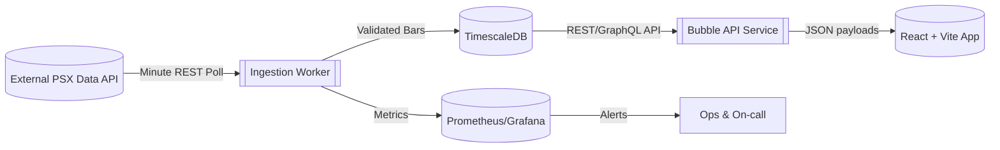

# Phase 0 Architecture Overview

## High-Level Flow

## Components
- **Ingestion Worker**: Containerized job triggered every minute; handles polling, dedupe, retries, and upserts into TimescaleDB.
- **TimescaleDB**: Primary data store for minute bars, continuous aggregates, and metadata tables.
- **Backend API Service**: Serves UI queries, performs aggregation lookups, exposes health endpoints, and enforces rate limiting.
- **Observability Stack**: Collects ingestion lag, API errors, DB health metrics, and routes alerts to on-call channels.
- **React Frontend**: Bubble chart app consuming backend APIs with manual refresh controls and pill indicators.

## Deployment Considerations
- Each environment (dev/stage/prod) runs isolated instances of ingestion workers and backend services connected to environment-specific TimescaleDB instances.
- Secrets delivered via environment-specific vault integrations.
- Network: Private VPC with outbound access to API provider; inbound traffic restricted through managed load balancers and WAF.

