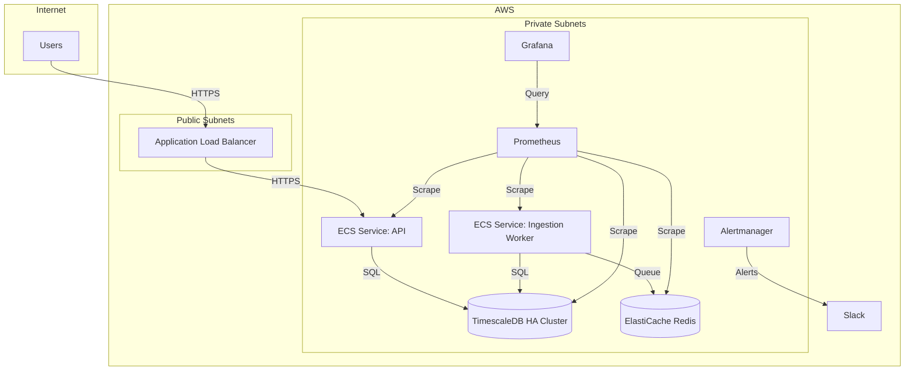

# Phase 7 – Deployment & Monitoring

## Containerization Strategy

### Ingestion Worker Image
- Runtime: Node.js 20 (matches project tooling); install `pnpm` for reproducible builds.  
- Copy package manifests and lockfile, install production dependencies, then copy worker sources (`server/poller.cjs` replacement or `workers/ingestion/*`).  
- Expect environment variables: `TIMESCALE_URL`, `TIMESCALE_USER`, `TIMESCALE_PASSWORD`, `WORKER_BATCH_SIZE`, `WORKER_POLL_INTERVAL`, `REDIS_URL` (if queue-backed).  
- Mount `config/` directory or inject via secrets if per-environment APIs differ.

```dockerfile
FROM node:20-slim AS base
ENV PNPM_HOME=/root/.local/share/pnpm
ENV PATH="$PNPM_HOME:$PATH"
RUN corepack enable

WORKDIR /app
COPY package.json pnpm-lock.yaml ./
RUN pnpm fetch

FROM base AS prod
COPY . .
RUN pnpm install --offline --prod

CMD ["node", "workers/ingestion/index.mjs"]
```

### API Service Image
- Runtime: Node.js 20 with `pnpm`.  
- Copy only `server/api` (or `src/api` if using Vite SSR) and static bundle from `dist/`.  
- Environment: `PORT`, `NODE_ENV`, `TIMESCALE_URL`, `CACHE_URL`, `UPSTREAM_TIMEOUT_MS`, `JWT_SECRET`.  
- Healthcheck endpoint at `/healthz` returning 200 + version metadata for monitoring.

```dockerfile
FROM node:20-slim AS build
ENV PNPM_HOME=/root/.local/share/pnpm
ENV PATH="$PNPM_HOME:$PATH"
RUN corepack enable

WORKDIR /app
COPY package.json pnpm-lock.yaml ./
RUN pnpm fetch
COPY . .
RUN pnpm install --offline --prod && pnpm run build

FROM gcr.io/distroless/nodejs20-debian11 AS prod
WORKDIR /app
COPY --from=build /app/node_modules ./node_modules
COPY --from=build /app/dist ./dist
COPY --from=build /app/server ./server
ENV NODE_ENV=production
EXPOSE 8080
CMD ["server/api/index.mjs"]
```

### Docker Compose (Staging Illustration)

```yaml
version: "3.9"
services:
  api:
    image: ghcr.io/org/cryptobubbles-api:${GIT_SHA}
    env_file: env/staging/api.env
    ports:
      - "8080:8080"
    depends_on:
      - timescale
      - redis
    deploy:
      replicas: 2
      update_config:
        order: start-first
  worker:
    image: ghcr.io/org/cryptobubbles-worker:${GIT_SHA}
    env_file: env/staging/worker.env
    depends_on:
      - timescale
      - redis
    deploy:
      replicas: 1
      restart_policy:
        condition: on-failure
  timescale:
    image: timescale/timescaledb-ha:pg16
    env_file: env/staging/timescale.env
    volumes:
      - timescale-data:/var/lib/postgresql/data
  redis:
    image: redis:7-alpine
    command: ["redis-server", "--save", "", "--appendonly", "no"]
  prometheus:
    image: prom/prometheus:v2.54.0
    volumes:
      - ./ops/prometheus/prometheus.yml:/etc/prometheus/prometheus.yml:ro
  grafana:
    image: grafana/grafana:11.0.0
    environment:
      - GF_SECURITY_ADMIN_USER=admin
      - GF_SECURITY_ADMIN_PASSWORD=changeme
    volumes:
      - grafana-data:/var/lib/grafana

volumes:
  timescale-data:
  grafana-data:
```

Notes: use external secrets for production (AWS Secrets Manager, Doppler, 1Password). For production orchestration, translate services into ECS/Fargate tasks, Kubernetes Deployments, or Nomad jobs.

## CI/CD Pipeline

### Workflow Overview (GitHub Actions)
1. `build` job (push + PR): install dependencies, run tests/lint, build assets.  
2. `docker` job: build and push worker + API images tagged with `${GIT_SHA}` and `${SEMVER}` to GHCR/ECR.  
3. `staging` deploy: gated on `main` branch merge, triggers `deploy-staging` reusable workflow that updates ECS service or Kubernetes namespace via `helm upgrade`.  
4. `prod` deploy: manual approval (`workflow_dispatch`), promotes staging image (no rebuild) by retagging to `prod` and updating service.  
5. `post-deploy` job: run smoke tests + healthcheck verification (check `/healthz`, ingestion queue depth).

```yaml
name: ci-cd

on:
  push:
    branches: [main]
  pull_request:
    branches: [main]
  workflow_dispatch:
    inputs:
      environment:
        description: "staging | production"
        required: true

jobs:
  build:
    runs-on: ubuntu-latest
    steps:
      - uses: actions/checkout@v4
      - uses: actions/setup-node@v4
        with:
          node-version: 20
          cache: pnpm
      - run: corepack enable
      - run: pnpm install --frozen-lockfile
      - run: pnpm test
      - run: pnpm run build

  docker:
    needs: build
    runs-on: ubuntu-latest
    permissions:
      packages: write
      contents: read
    env:
      REGISTRY: ghcr.io/org
      IMAGE_TAG: ${{ github.sha }}
    steps:
      - uses: actions/checkout@v4
      - uses: docker/setup-buildx-action@v3
      - uses: docker/login-action@v3
        with:
          registry: ghcr.io
          username: ${{ github.actor }}
          password: ${{ secrets.GITHUB_TOKEN }}
      - uses: docker/build-push-action@v6
        with:
          context: .
          file: Dockerfile.worker
          push: true
          tags: ${{ env.REGISTRY }}/cryptobubbles-worker:${{ env.IMAGE_TAG }}
      - uses: docker/build-push-action@v6
        with:
          context: .
          file: Dockerfile.api
          push: true
          tags: ${{ env.REGISTRY }}/cryptobubbles-api:${{ env.IMAGE_TAG }}

  deploy-staging:
    needs: docker
    if: github.ref == 'refs/heads/main'
    uses: ./.github/workflows/deploy.yml
    with:
      environment: staging
    secrets: inherit

  deploy-production:
    needs: deploy-staging
    if: github.event_name == 'workflow_dispatch' && inputs.environment == 'production'
    uses: ./.github/workflows/deploy.yml
    with:
      environment: production
    secrets: inherit
```

### Secrets & Config
- Image registry credentials (`GHCR_TOKEN`/AWS ECR).  
- Database credentials (use OIDC for AWS so jobs assume role without static keys).  
- Slack / PagerDuty webhooks for alert notifications.  
- Staging vs production `.env` stored in Parameter Store/Secrets Manager; workflow pulls and renders `appsettings` config via `aws ssm get-parameter` or `doppler secrets download`.

## Infrastructure Layout

Mermaid diagram for staging/prod (adopted for ECS + Fargate example):



Operational notes:
- Deploy ECS services in multiple AZs; min 2 API tasks, worker can scale `1..N` with CloudWatch scheduled scaling (e.g., increase during market open).  
- Use Secrets Manager + task IAM roles for credentials.  
- Timescale in RDS Multi-AZ with automated backups + replica for analytics.  
- Prometheus/Grafana stack can run in ECS (with persistent EFS) or managed services (Amazon Managed Prometheus/Grafana) for reduced ops burden.

## Monitoring & Alerting

### Metrics Sources
- Ingestion worker exposes `/metrics` (Prometheus format) via `express-prom-bundle` with custom gauges: `ingestion_lag_seconds`, `ingestion_batches_processed_total`, `ingestion_failures_total`.  
- API service uses `prom-client` histogram: `http_request_duration_seconds{route=...,status=...}` and counter `http_errors_total`.  
- TimescaleDB scraped via `postgres_exporter` with metrics `pg_stat_database`, `timescale_chunks_disk_size_bytes`.  
- Redis metrics via `redis_exporter` for queue length.

### Grafana Dashboards
- **Ingestion Lag**: Panel for `max(ingestion_lag_seconds)` grouped by feed; stacked bar for `ingestion_failures_total` per feed; annotation for deploys.  
- **API Latency**: Heatmap from `histogram_quantile` (p50/p95/p99 of `http_request_duration_seconds`), table for slow endpoints, stat for overall error rate.  
- **Error Rates**: Panel showing `increase(http_errors_total[5m])` vs success counters, plus log panel if Loki available.  
- **DB Storage Growth**: Panel with `timescale_chunks_disk_size_bytes` per hypertable, `pg_database_size_bytes` trend, table for `dead_tuple_percent` to inform vacuuming.

### Alertmanager Rules (Examples)

```yaml
groups:
  - name: ingestion
    rules:
      - alert: IngestionLagHigh
        expr: max_over_time(ingestion_lag_seconds[10m]) > 300
        for: 10m
        labels:
          severity: critical
        annotations:
          summary: "Ingestion lag above 5 minutes"
          runbook: "https://runbooks.cryptobubbles.local/ingestion-lag"
      - alert: IngestionFailuresSpike
        expr: increase(ingestion_failures_total[5m]) > 5
        labels:
          severity: warning
  - name: api
    rules:
      - alert: APIP95LatencyHigh
        expr: histogram_quantile(0.95, sum(rate(http_request_duration_seconds_bucket[5m])) by (le)) > 1.0
        for: 5m
        labels:
          severity: critical
      - alert: APIErrorRate
        expr: sum(rate(http_errors_total[5m])) by (service) / sum(rate(http_requests_total[5m])) by (service) > 0.05
        for: 10m
        labels:
          severity: warning
  - name: timescale
    rules:
      - alert: TimescaleStorageGrowth
        expr: predict_linear(pg_database_size_bytes{datname="cryptobubbles"}[1d], 7*24*3600) > storage_quota_bytes
        labels:
          severity: warning
      - alert: TimescaleDeadTuplesHigh
        expr: max(pg_stat_user_tables_dead_tuple_percent) > 20
        for: 30m
        labels:
          severity: warning
  - name: infra
    rules:
      - alert: TaskRestartLoop
        expr: increase(container_start_time_seconds[10m]) > 3
        labels:
          severity: critical
```

- Alert destinations: Slack for warning + info, PagerDuty for critical alerts.  
- Use Alertmanager routing to silence during planned maintenance windows.

## TimescaleDB Maintenance Tasks

- **Backups**: Enable nightly automated snapshots (RDS) + weekly logical dumps (`pg_dump`) stored in S3 with 14-day retention. Test restores quarterly.  
- **Retention Policies**: Use Timescale continuous aggregates + compression with policies (`add_retention_policy`) to keep raw ticks 90 days, aggregates 1 year.  
- **Vacuum / Analyze**: Schedule `VACUUM (ANALYZE)` on hypertables weekly; monitor `dead_tuple_percent` metric to trigger ad-hoc vacuums.  
- **Reindex**: Monthly `REINDEX TABLE` on high-churn hypertables; automate via maintenance window job.  
- **Compression & Chunk Management**: Apply `ALTER TABLE ... SET (timescaledb.compress)` and schedule `run_compression_policy` to compress chunks older than 7 days.  
- **Upgrades**: Track Timescale + PostgreSQL releases; rehearse blue/green upgrade using read replica promotion.  
- **Integrity Checks**: Weekly `pg_checksums` verification and `pg_amcheck` on indexes.  
- **Monitoring**: Dashboards for `timescale_lag_agg`, WAL generation, replication lag, connection usage; alerts for `max_connections` > 80% and WAL disk utilization.


